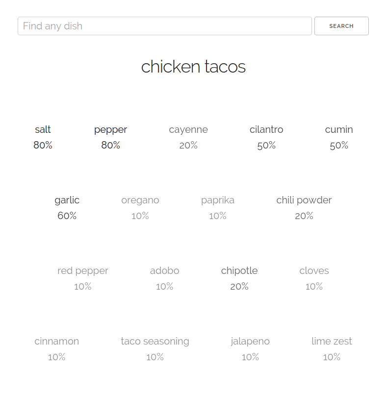

# WhichSpice



Helps you find suitable spices for different dishes. Uses the Yummly API to collect recipies and break them down by ingredients.

## Installation
You'll need to get an id and key from yummly.
```bash
$ npm install
$ export YUMMLY_APPID="..."
$ export YUMMLY_APPKEY="..."
$ node app.js
```
Now point your web browser to `localhost:3000`
